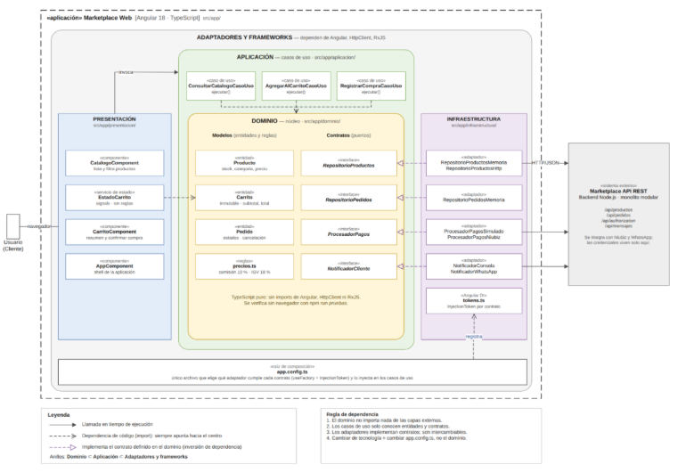

# Enfoque Arquitectónico: Clean Architecture

## Descripción del Enfoque Seleccionado

Para la organización interna del código del **Marketplace de Productos para Mascotas**, se adopta el enfoque de **Clean Architecture (Arquitectura Limpia)**. 

El objetivo principal es separar las responsabilidades de la aplicación y controlar estrictamente que las dependencias apunten hacia el núcleo del dominio.

| Elemento | Descripción Aplicada al Marketplace |
|---|---|
| **Patrón / Enfoque Arquitectónico** | Clean Architecture (Arquitectura Limpia). |
| **Objetivo** | Separar responsabilidades y controlar las dependencias hacia el dominio. |
| **¿Qué problema resuelve?** | Evita el acoplamiento entre la interfaz Angular, las reglas del negocio y las tecnologías externas (bases de datos, API REST, pasarela de pagos). |
| **Capas Definidas** | Presentación, Aplicación, Dominio e Infraestructura. |
| **Beneficios** | • Facilita el mantenimiento y las pruebas unitarias. • Permite cambiar implementaciones técnicas sin modificar las reglas del negocio. • Mejora la organización y separación de responsabilidades en el código. |

---

## Estructura de Capas y Dependencias

