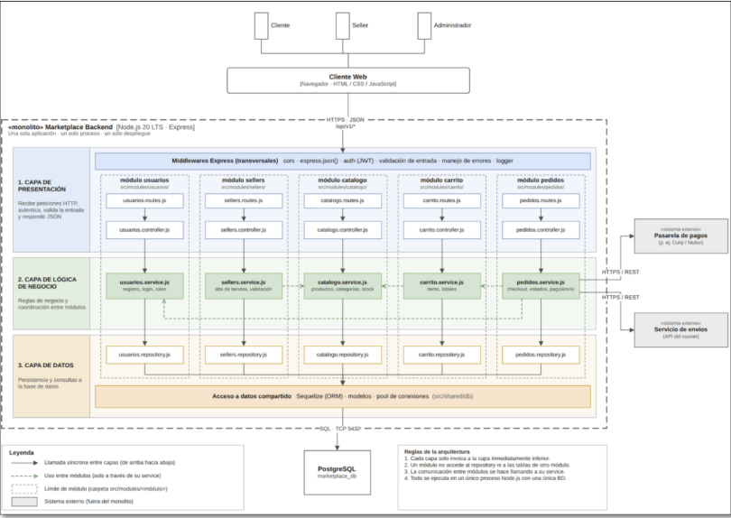

# Estilo Arquitectónico del Sistema

## Descripción del Estilo Seleccionado

Para el **Marketplace de Productos para Mascotas**, se ha seleccionado el estilo de **Monolito Modular Organizado en Capas**.

Esta elección permite consolidar el despliegue en una única unidad (fácil de operar e implementar en etapas iniciales), manteniendo una separación clara de responsabilidades por módulos funcionales (Usuarios, Sellers, Catálogo, Carrito y Pedidos) y capas lógicas.

| Elemento | Descripción Aplicada al Marketplace |
|---|---|
| **Estilo Arquitectónico** | Monolito Modular en Capas. |
| **Objetivo** | Organizar el sistema en un solo despliegue manteniendo módulos independientes y separación de capas. |
| **¿Qué problema resuelve?** | Evita la complejidad prematura de infraestructura distribuida sin perder modularidad para futura escalabilidad. |
| **Componentes Clave** | Cliente Web (Angular), Middlewares, Capa de Presentación, Capa de Lógica de Negocio, Capa de Datos (PostgreSQL), Pasarela de Pagos y Servicios de Envíos. |
| **Beneficios** | Facilidad de desarrollo, despliegue unificado, mantenimiento ordenado y capacidad de escalamiento horizontal. |

---

## Diagrama Global de la Arquitectura

